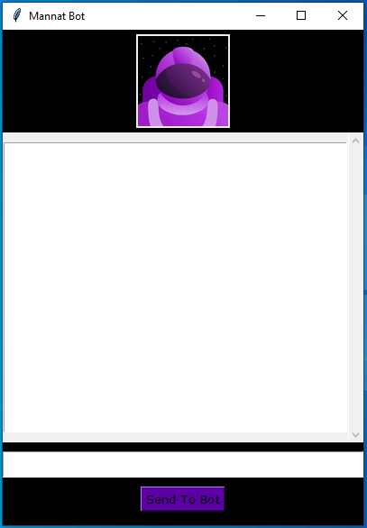

[](https://github.com/imsanjoykb/Voice-Enable-ChatBot/)


# Author: Sanjoy Biswas

Data Scientist | Machine Learning Engineer </br>
Website: https://imsanjoykb.github.io/ </br>
ResearchGate: https://www.researchgate.net/profile/imsanjoykb </br>
Linkedin: https://www.linkedin.com/in/imsanjoykb/ </br>
Email: sanjoy.eee32@gmail.com <br>

<hr>


## Project Description

This is originally, developed with Voice Enable ChatBot system. Here user can be asked question to Bot both Voice or writing text. In the particularly bot also answer the question with voice and text also.

<hr>

## Project Installation

<b>Install the virtualenv package</b>
```
pip install virtualenv  
```
<b>Create the virtual environment</b>
```
virtualenv venv 
```
<b>Activate the virtual environment</b>
```
mypthon\Scripts\activate
```
<b>Install Dependencies</b>
```
pip3 install -r requirements.txt
```
<b>Run The App</b>
```
python main.py
```

<hr>

## Project GUI
Project Interface:<br>



Project Interface With Text:<br>


<hr>

## Conclusion:
With Artificial Intelligence and Natural Language Processing technologies, My chatbots are able to make inferences about what users primarily mean, or their intent.
They automatically adjust classification parameters depending on the success rates of the answers.

